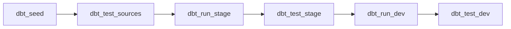

# Week 6: Automate with Airflow

This week nobody runs `dbt` by hand. You'll bring up **Airflow**, read a DAG that already orchestrates your whole pipeline, trigger it and watch the tasks go green — then extend it with a `dbt build` task and teach it how to behave when something fails. Budget: **~2 hours**.

---

## 📖 Lesson Overview

* **DAGs:** a DAG is just a Python file describing *what runs, in what order*. Airflow reads it, draws the graph, and schedules it — your SQL doesn't change at all.
* **The BashOperator:** the simplest way to run something. Each task shells out and runs one `dbt` command, exactly like you've been typing all along.
* **Retries & Catchup:** the two settings that separate "it worked on my laptop" from "it runs unattended at 6am" — retry a flaky task automatically, and don't stampede through every missed run.

---

## 🌬️ Bringing the Stack Up

Everything is already in `docker-compose.yml` — Postgres, the Airflow scheduler, and the web UI:

```bash
docker compose build
docker compose up -d
```

Then open **<http://localhost:8080>** and log in with `admin` / `admin`.

The DAG you're about to read lives in [`airflow/dags/dbt_pipeline.py`](../airflow/dags/dbt_pipeline.py) and runs six tasks in a line:

| Task | dbt command | What it does |
|---|---|---|
| `dbt_seed` | `dbt seed` | Loads the raw CSVs into `RAW` |
| `dbt_test_sources` | `dbt test --select "source:*"` | Checks the raw data before building on it |
| `dbt_run_stage` | `dbt run --select stage` | Builds the five `STAGE` views |
| `dbt_test_stage` | `dbt test --select stage` | Tests the staging layer |
| `dbt_run_dev` | `dbt run --select dev` | Builds the dimensions and facts in `DEV` |
| `dbt_test_dev` | `dbt test --select dev` | Tests the warehouse |



> 💡 **Airflow runs dbt directly — there's no Docker-in-Docker.** dbt is installed into the Airflow image (see `Dockerfile.airflow`), and `docker-compose.yml` mounts your `dbt_learning/` folder at `/opt/airflow/dbt` inside the container. That's why every task starts with `cd /opt/airflow/dbt`, and why edits you make on your machine are picked up with no rebuild.

---

## 📝 Assignment Tasks

### Task 6.1 — Read & Run the DAG (30 pts)

Before changing anything, **read** [`airflow/dags/dbt_pipeline.py`](../airflow/dags/dbt_pipeline.py) top to bottom. Find the `dbt_task()` helper and satisfy yourself that you could write out the exact bash command any one of those six tasks will run.

Then run it:

1. In the Airflow UI, find `dbt_pipeline` in the DAG list and **unpause** it (the toggle on the left).
2. Hit the **▶ Trigger** button.
3. Open the **Graph** view and watch the six tasks turn green, one after another.

If a task goes red, click it → **Logs**. The dbt output is in there verbatim, the same text you'd see in your terminal.

> ⚠️ **If the DAG doesn't appear at all**, it failed to import. Ask Airflow why, rather than guessing:
> ```bash
> docker compose exec airflow-scheduler airflow dags list-import-errors
> ```

**Deliverable:** a screenshot of the **Graph view with all six tasks green**, saved into the `week_6/` folder (any `.png` or `.jpg`). The grader looks for an image file in `week_6/`, so commit it alongside this README.

### Task 6.2 — Add a Build Task (50 pts)

The pipeline currently runs `run` and `test` as separate steps for each layer. `dbt build` does both at once — it builds each model and immediately runs that model's tests before anything downstream of it starts. One bad model stops its own dependents instead of poisoning the whole warehouse.

Add a seventh task that runs it, and wire it onto the end of the chain. Use the `dbt_task()` helper that's already in the file — that's what it's there for:

```python
dbt_build = dbt_task(dag, "dbt_build", "build")
```

Then extend the dependency chain so it runs last:

```python
(
    dbt_seed
    >> dbt_test_sources
    >> dbt_run_stage
    >> dbt_test_stage
    >> dbt_run_dev
    >> dbt_test_dev
    >> dbt_build
)
```

> 💡 **This is where Week 3 pays off.** `dbt build` fails the task on any `error`-severity test failure. The tests you deliberately set to `severity: warn` back in Week 3 are exactly the ones that will warn here instead of halting your pipeline at 6am.

Trigger the DAG again and confirm the new task appears in the graph and finishes green.

**Deliverable:** a `dbt_build` task in `dbt_pipeline.py` using `BashOperator` (via `dbt_task()`), running `dbt build`, wired into the chain with `>>` — and a DAG run where it goes green.

### Task 6.3 — Basic Retry Config (20 pts)

A scheduled pipeline runs when nobody is watching. Two settings make that survivable.

**1. Retries.** A dropped database connection shouldn't need a human. In `default_args`, give every task two attempts in reserve, five minutes apart:

```python
default_args = {
    "owner": "student_name",
    "depends_on_past": False,
    "retries": 2,
    "retry_delay": timedelta(minutes=5),
}
```

`timedelta` is already imported at the top of the file.

**2. Catchup.** Add `catchup=False` to the `DAG(...)` call:

```python
with DAG(
    dag_id="dbt_pipeline",
    ...
    schedule="0 6 * * *",
    catchup=False,
    tags=["dbt", "dataops"],
) as dag:
```

> ⚠️ **What `catchup` actually does.** It defaults to **`True`**. With a daily schedule and a `start_date` in the past, the moment you unpause the DAG Airflow will queue up *one run for every day since that date* and work through the backlog. On a 60-day-old start date that's 60 pipeline runs, all at once, all hammering the same Postgres. `catchup=False` tells Airflow to only run from now on.

**Deliverable:** `retries=2` and `retry_delay` set in `default_args`, `catchup=False` on the DAG, and the DAG still imports cleanly with no errors.

---

## 🤖 Auto-Grade Your Work

```bash
python scripts/grade_assignment.py --week 6
```

Fix any ❌ items and re-run. 🚀
